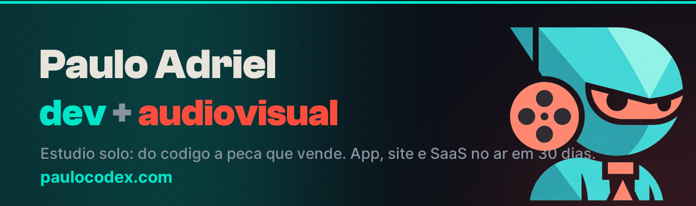

  

  <b>Estúdio solo de software + audiovisual.</b> Eu construo o app/site <b>e</b> faço o vídeo que vende ele — do código ao lançamento, no ar em <b>30 dias</b>.

  
  
  

---

### O que eu faço

- **Apps completos** — desktop e mobile (Tauri, Flutter, React), do design à loja, com licença e updates.
- **Sites & SaaS** — landing que vende, painéis, marketplaces. Rápidos, no ar, otimizados pra conversão.
- **Audiovisual** — identidade, motion, trailer e material de loja. O produto sai pronto pra ser mostrado *e* comprado.

### 🚀 Produtos & projetos

| Projeto | O que é | Status | Links |
|---|---|---|---|
| **PRISMA** | Gerenciador de mídia pra quem edita | À venda | [apresentação](https://github.com/Paulothedeveloper/prisma-app) · [comprar](https://paulocodex.com/comprar?product=prisma) |
| **Ludex** | Launcher retro multi-emulador | À venda | [apresentação](https://github.com/Paulothedeveloper/ludex) · [comprar](https://paulocodex.com/comprar?product=ludex) |
| **Vorath RPG** | RPG de mesa solo narrado por IA | Beta | [apresentação](https://github.com/Paulothedeveloper/Vorath-showcase) · [acessar](https://github.com/Paulothedeveloper/vorath-releases/releases/latest) |
| **Quartzo** | Segundo cérebro em Markdown, local-first | À venda | [apresentação](https://github.com/Paulothedeveloper/quartzo-app) · [comprar](https://paulocodex.com/comprar?product=quartzo) |
| **Ellae** | App social pra mulheres | No ar | [apresentação](https://github.com/Paulothedeveloper/ellae-app) · [acessar](https://ellae.app) |
| **BladeBrust** | Marketplace + comunidade de piões | No ar | [apresentação](https://github.com/Paulothedeveloper/bladebrust-app) · [acessar](https://baybladebrust-61393.web.app) |
| **Torque** | Plataforma all-in-one pra oficina mecânica | No ar | [apresentação](https://github.com/Paulothedeveloper/torque-app) · [acessar](https://torqueoficina.com.br) |
| **RÉGUA** | SaaS de barbearia com simulação | Beta | [apresentação](https://github.com/Paulothedeveloper/naregua-app) · [acessar](https://regua-barbearia.web.app) |
| **Velvet** | Esteira de looks pro seu vídeo | Em dev | [apresentação](https://github.com/Paulothedeveloper/velvet-color) |
| **Mirage** | Publique em todas as redes de uma vez | Beta | [apresentação](https://github.com/Paulothedeveloper/mirage-app) · [acessar](https://mirage-social-app.web.app) |
| **Recibo na Hora** | Recibo profissional em segundos | Em dev | [apresentação](https://github.com/Paulothedeveloper/recibo-na-hora-app) |
| **Codex IG Tools** | Ferramentas de crescimento de Instagram | Grátis | [ver](https://github.com/Paulothedeveloper/codex-ig-tools-showcase) |

> Repositórios de **apresentação** — código-fonte fechado, zero segredo/PII exposto.

### 🛠️ Stack

### 📊 GitHub

  
  

<i>Tem uma ideia? Em 30 dias ela tá no ar.</i> — <a href="https://paulocodex.com">paulocodex.com</a>

